# Análisis de Campaña: Abuso del Sistema de Partner Requests de Meta Business
# Campaign Analysis: Meta Business Partner Request Abuse

<div align="center">
  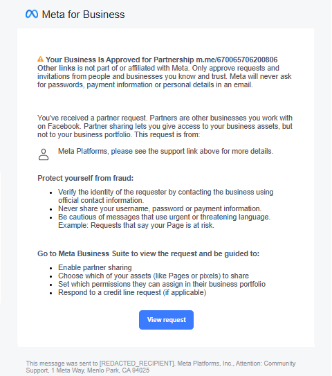
  <br>
<i>Vista del mensaje desde la víctima / Victim's message view</i>
</div>

<br>

**Autor / Author:** Luis Ernesto P. CH. — Blue Team Specialist · ISO 27001 Internal Auditor  
**Fecha / Date:** 2026-05-26  
**TLP:** WHITE — Distribución pública / Public distribution  
**Versión / Version:** 1.1  
**LinkedIn:** [linkedin.com/in/luis-ernesto-p-ch/](https://www.linkedin.com/in/luis-ernesto-p-ch/)  
**GitHub:** [noahverner1995](https://github.com/noahverner1995)

---

## Índice / Table of Contents

1. [Resumen ejecutivo / Executive Summary](#1-resumen-ejecutivo--executive-summary)
2. [Contexto y variante identificada / Context and Identified Variant](#2-contexto-y-variante-identificada--context-and-identified-variant)
3. [Metodología de análisis / Analysis Methodology](#3-metodología-de-análisis--analysis-methodology)
4. [Cadena de ataque detallada / Detailed Attack Chain](#4-cadena-de-ataque-detallada--detailed-attack-chain)
5. [Indicadores de compromiso / Indicators of Compromise](#5-indicadores-de-compromiso--indicators-of-compromise-iocs)
6. [Mapeo a MITRE ATT&CK / MITRE ATT&CK Mapping](#6-mapeo-a-mitre-attck--mitre-attck-mapping)
7. [Evidencia de campaña activa / Evidence of Active Campaign](#7-evidencia-de-campaña-activa--evidence-of-active-campaign)
8. [Recomendaciones de mitigación y defensa / Mitigation & Defense](#8-recomendaciones-de-mitigación-y-defensa--mitigation--defense)
9. [Apéndice A — Cabeceras redactadas / Appendix A — Redacted Headers](#apéndice-a--appendix-a)
10. [Referencias / References](#referencias--references)

---

## 1. Resumen ejecutivo / Executive Summary

**ES:** Este informe documenta y analiza una campaña de phishing activa que abusa del mecanismo legítimo de *partner requests* de Meta Business Manager. La muestra analizada corresponde a una notificación genuinamente generada por la infraestructura de Meta —con autenticación de correo perfecta (SPF, DKIM y DMARC = pass)— en la que el atacante inyecta un enlace de Messenger (`m.me/`) en el campo de nombre del negocio solicitante. Al ser un campo controlado por el usuario pero renderizado verbatim por la plantilla oficial de Meta, el correo es indistinguible de una notificación legítima para cualquier solución de seguridad basada en autenticación o reputación del remitente. La explotación ocurre completamente fuera de banda, a través de Messenger, sin que se use ningún dominio malicioso.

**EN:** This report documents and analyzes an active phishing campaign that abuses the legitimate partner request workflow of Meta Business Manager. The analyzed sample is a notification genuinely generated by Meta's infrastructure — with perfect email authentication (SPF, DKIM, and DMARC = pass) — in which the attacker injects a Messenger link (`m.me/`) into the requesting business's name field. Because this is a user-controlled field rendered verbatim by Meta's official template, the email is indistinguishable from a legitimate notification for any security solution based on sender authentication or reputation. Exploitation occurs entirely out-of-band, through Messenger, with no malicious domain used at any point.

---

## 2. Contexto y variante identificada / Context and Identified Variant

**ES:** El ataque pertenece a la categoría *Living off the Land* (LOtL) aplicada a plataformas SaaS de confianza. La variante aquí analizada presenta una característica técnicamente más avanzada que las reportadas públicamente por Prophet Security y alphaMountain: opera sin ningún dominio *lookalike*. Todos los enlaces resuelven a infraestructura legítima de Meta o Microsoft. El único componente hostil es texto en un campo de nombre, y la explotación real ocurre por Messenger.

**EN:** The attack belongs to the Living off the Land (LOtL) category applied to trusted SaaS platforms. The variant analyzed here is technically more advanced than those publicly reported by Prophet Security and alphaMountain: it operates without any lookalike domain. All links resolve to legitimate Meta or Microsoft infrastructure. The sole hostile component is text in a name field, and actual exploitation occurs via Messenger.

| Característica / Feature | Variantes documentadas / Documented Variants | Esta variante / This Variant |
|---|---|---|
| Dominio lookalike / Lookalike domain | Sí / Yes | **Ninguno / None** |
| Payload | URL a sitio de phishing / URL to phishing site | **m.me en campo de nombre / m.me in name field** |
| Explotación / Exploitation | Página de robo de credenciales / Credential theft page | **Ingeniería social en Messenger / Social Engineering on Messenger** |
| Detectable por / Detectable by URL intel | Sí (dominio nuevo en feeds) / Yes (new domain in feeds) | **No — toda la infra es legítima / No — all the infra is legit** |

### Diagrama de la cadena de ataque / Attack Chain Diagram

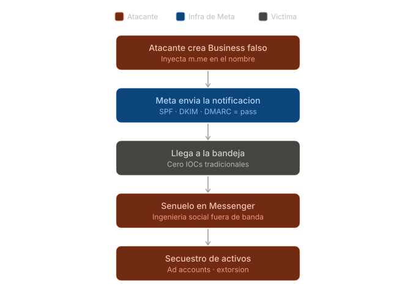

> Archivo fuente: `assets/attack_chain_diagram.svg`

---

## 3. Metodología de análisis / Analysis Methodology

**ES:** Esta sección describe el proceso forense paso a paso, reproducible por cualquier analista que reciba una muestra similar. Cada paso incluye capturas de pantalla de evidencia.

**EN:** This section describes the forensic process step by step, reproducible by any analyst receiving a similar sample. Each step includes evidence screenshots.

---

### Paso 1 — Obtención del origen del correo / Step 1 — Getting the Raw Message Source

**ES:** En Outlook web, el origen completo del mensaje (cabeceras MIME + cuerpo) se obtiene desde el menú de tres puntos (`...` → `Ver` → `Ver origen del mensaje`). Esto expone las cabeceras crudas que los clientes de correo normalmente ocultan, incluyendo los resultados de autenticación, la cadena de `Received:` y la firma DKIM. El contenido resultante es el `.eml` de la muestra.

**EN:** In Outlook web, the complete message source (MIME headers + body) is obtained from the three-dot menu (`...` → `View` → `View message source`). This exposes the raw headers normally hidden by mail clients, including authentication results, the `Received:` chain, and the DKIM signature. The resulting content is the sample's `.eml` file.

<div align="center">
  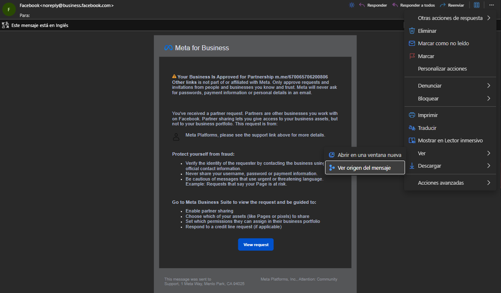
</div>

---

### Paso 2 — Análisis de cabeceras de autenticación / Step 2 — Authentication Header Analysis

**ES:** Las primeras líneas del origen del mensaje contienen los resultados de autenticación agregados por Microsoft Exchange Online Protection (EOP) al recibir el correo. Son los más importantes para determinar si el remitente es legítimo.

**EN:** The first lines of the message source contain the authentication results added by Microsoft Exchange Online Protection (EOP) upon receipt. These are the most important for determining whether the sender is legitimate.

```
Authentication-Results:
  spf=pass    (sender IP is 69.171.232.142)
              smtp.mailfrom=business.facebook.com
  dkim=pass   (signature was verified)
              header.d=business.facebook.com
  dmarc=pass  action=none
              header.from=business.facebook.com
  compauth=pass reason=100
```

<div align="center">
  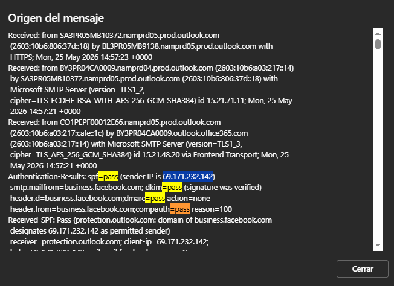
</div>

---

### Paso 3 — Extracción de URLs desde el cuerpo HTML con DevTools / Step 3 — URL Extraction from HTML Body Using DevTools

**ES:** Para identificar los destinos reales de los enlaces sin hacer clic, se usaron las Herramientas de Desarrollador del navegador (Brave, `Ctrl+Shift+I`). La función de búsqueda del inspector de elementos permite localizar cadenas específicas dentro del DOM renderizado del correo.

**EN:** To identify the real link destinations without clicking, the browser's Developer Tools were used (Brave, `Ctrl+Shift+I`). The element inspector's search function allows locating specific strings within the rendered DOM of the email.

#### 3.1 Enlace `m.me/670065706200806` / `m.me/670065706200806` link

**ES:** Al buscar `m.me/670065706200806` en el inspector, se encontraron 4 ocurrencias. Todas corresponden a texto plano (no están dentro de etiquetas `<a href="...">`), confirmando que el enlace no es directamente clickeable en la renderización del correo. Está incrustado como texto dentro del "nombre del negocio" del solicitante:

**EN:** Searching for `m.me/670065706200806` in the inspector returned 4 matches. All correspond to plain text (not inside `<a href="...">` tags), confirming the link is not directly clickable in the email rendering. It is embedded as text within the requester's "business name" field:

```html
<span style="font-weight: bold;">
  Your Business Is Approved for Partnership m.me/670065706200806 Other links
</span>
is not part of or affiliated with Meta. Only approve requests and invitations
from people and businesses you know and trust...
```

<div align="center">
  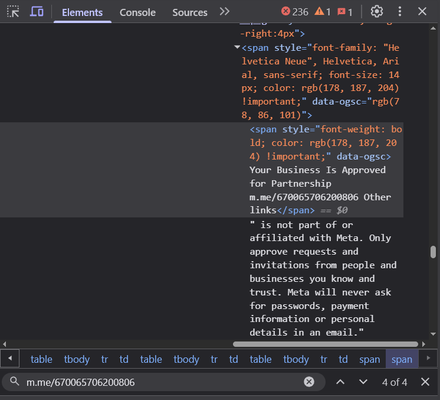
</div>

#### 3.2 Botón "View request" / "View request" button

**ES:** Al inspeccionar el botón "View request", el atributo `originalsrc` (inyectado por Outlook SafeLinks) revela la URL real de destino antes del envoltorio de protección de Microsoft:

**EN:** Inspecting the "View request" button, the `originalsrc` attribute (injected by Outlook SafeLinks) reveals the real destination URL before Microsoft's protection wrapper:

```html
<a href="https://na01.safelinks.protection.outlook.com/?url=https%3A%2F%2Fbusiness.facebook.com..."
   originalsrc="https://business.facebook.com/settings/partners/980425691238214/?business_id=2836451836418284">
  View request
</a>
```

**ES:** La URL real es `https://business.facebook.com/settings/partners/980425691238214/?business_id=2836451836418284`, una URL genuina de Meta que abre el partner request real del atacante.

**EN:** The real URL is `https://business.facebook.com/settings/partners/980425691238214/?business_id=2836451836418284` — a genuine Meta URL that opens the attacker's real partner request.

<div align="center">
  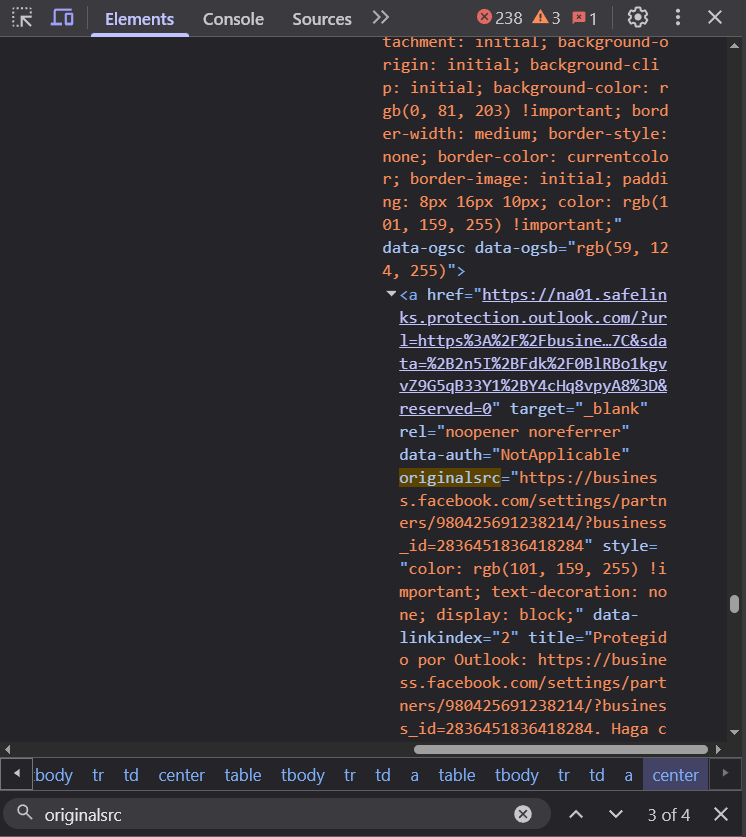
</div>

#### 3.3 Elementos "facebook.com" y "support link above" / "facebook.com" and "support link above" elements

**ES:** El bloque "facebook.com / Visitar el sitio" corresponde al *chrome* de la interfaz de Outlook (tarjeta del remitente, clases Fluent UI como `fui-Avatar`, `ms-Button`), no al cuerpo del correo. No es un enlace controlado por el atacante. El texto "please see the support link above" es texto plano sin `href`, parte del nombre inyectado por el atacante como nombre del "solicitante" (`Meta Platforms, please see the support link above for more details`). No existe ningún "support link" real.

**EN:** The "facebook.com / Visit site" block corresponds to Outlook's interface chrome (sender card, Fluent UI classes like `fui-Avatar`, `ms-Button`), not the email body. It is not a link controlled by the attacker. The text "please see the support link above" is plain text without an `href`, part of the attacker's injected requester display name (`Meta Platforms, please see the support link above for more details`). There is no actual "support link."

---

### Paso 4 — Análisis pasivo de URLs / Step 4 — Passive URL Analysis

**ES:** Todas las herramientas de threat intelligence se usaron en modo pasivo (sin hacer clic en los enlaces originales). Los resultados deben interpretarse en el contexto de que **toda la infraestructura involucrada es legítima de Meta/Microsoft**, por lo que la ausencia de flags maliciosos es esperada y, paradójicamente, confirma la naturaleza sofisticada del ataque.

**EN:** All threat intelligence tools were used in passive mode (without clicking the original links). Results must be interpreted in the context that **all infrastructure involved is legitimate Meta/Microsoft**, so the absence of malicious flags is expected and, paradoxically, confirms the sophisticated nature of the attack.

#### 4.1 Análisis de `m.me/670065706200806`

**urlscan.io** — Resultado: https://urlscan.io/result/019e627a-e78c-774e-824e-1c069791133b/

| Campo / Field | Valor / Value | Interpretación / Interpretation |
|---|---|---|
| Submitted URL | `http://m.me/670065706200806` | URL enviada al scanner |
| Cadena de redirección / Redirect chain | `http://m.me/` → 307 → `https://m.me/` → 302 → `https://www.messenger.com/login/?next=...` | Flujo normal de m.me sin sesión activa |
| IPs contactadas / IPs contacted | 4 IPs: `157.240.0.13`, `57.144.248.128`, `57.144.248.1`, `2a03:2880:f084:...` | Todas en ASN 32934 |
| ASN | **32934 (FACEBOOK - Facebook, Inc., US)** para las 4 IPs | Infraestructura 100% de Meta |
| PTR de IP principal | `edge-star-shv-02-fra3.facebook.com` | Nodo edge de Meta en Frankfurt (fra3) |
| Dominio efectivo | `www.messenger.com` | Dominio legítimo de Meta |
| Veredicto / Verdict | **No classification** | Sin clasificación maliciosa |

**ES:** Las "IPs de Alemania" mencionadas son nodos edge de Meta en Frankfurt (fra3 = Frankfurt datacenter 3), completamente normales. urlscan.io se ejecutó desde un servidor en Alemania (`Scanned from DE`), y el escaneo fue enviado desde Colombia (`from CO`), lo que explica por qué resolvió al PoP europeo más cercano. No tienen relación con el atacante.

**EN:** The "German IPs" mentioned are Meta edge nodes in Frankfurt (fra3 = Frankfurt datacenter 3), completely normal. urlscan.io ran from a server in Germany (`Scanned from DE`), and the scan was submitted from Colombia (`from CO`), which explains why it resolved to the nearest European PoP. They have no relation to the attacker.

<div align="center">
  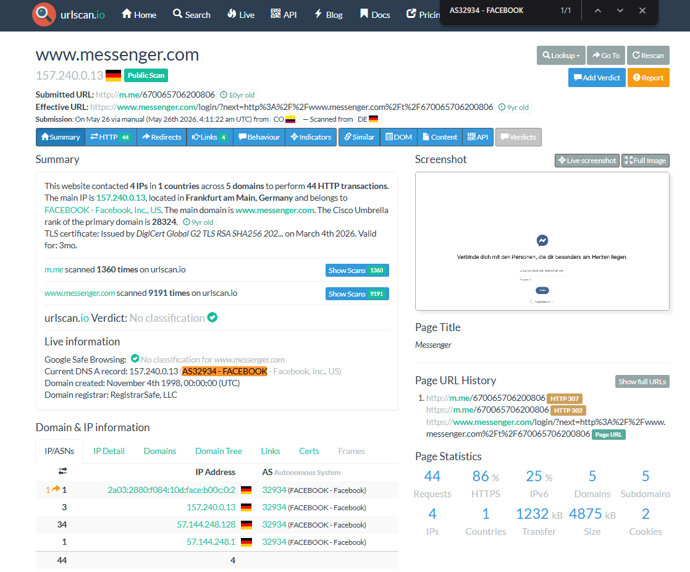
</div>

<div align="center">
  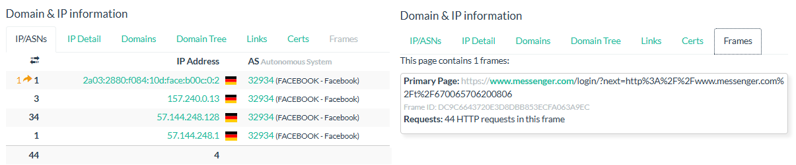
</div>

**VirusTotal** — Resultado: https://www.virustotal.com/gui/url/307bc09ea9934d90eea305f63d0d534c26b672a911f8393d5b495a1b673d4184

**ES:** 1 de ~90 proveedores de seguridad marcó la URL como maliciosa. Esta es una señal débil y no es indicador de maliciosidad real de la URL. `m.me` es un dominio de acortamiento de Messenger compartido por cientos de millones de URLs, algunas de las cuales son maliciosas por su contenido, no por el dominio. El dominio en sí es legítimo de Meta.

**EN:** 1 out of ~90 security vendors flagged the URL as malicious. This is a weak signal and not an indicator of real URL maliciousness. `m.me` is a Messenger shortener domain shared by hundreds of millions of URLs, some of which are malicious by their content, not by the domain itself. The domain itself is legitimate Meta infrastructure.

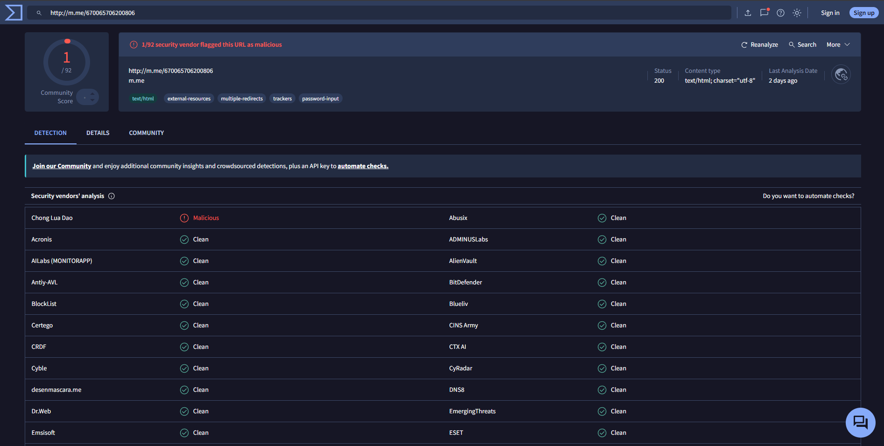

**URLhaus** y **threatYeti** / URLhaus and threatYeti

**ES:** URLhaus muestra múltiples entradas con la etiqueta "ClearFake" en búsquedas relacionadas con las URLs del caso. Esto es un **falso positivo de búsqueda**: ClearFake es una campaña de malware completamente distinta. URLhaus hace coincidencia por subcadenas comunes (como `m.me/` o `na01.safelinks.protection.outlook.com`) presentes en millones de URLs no relacionadas. Estas entradas **no están relacionadas con la muestra analizada**.

threatYeti califica `m.me` como "2.45 — bajo riesgo". Esto es esperado porque `m.me` es un dominio legítimo de Meta con alta reputación. El bajo riesgo confirma que la maliciosidad no reside en la infraestructura sino en el contenido semántico del correo.

**EN:** URLhaus shows multiple entries tagged "ClearFake" in searches related to the case URLs. This is a **search false positive**: ClearFake is an entirely different malware campaign. URLhaus matches by common substrings (such as `m.me/` or `na01.safelinks.protection.outlook.com`) present in millions of unrelated URLs. These entries **are not related to the analyzed sample**.

threatYeti rates `m.me` as "2.45 — low risk." This is expected because `m.me` is a legitimate Meta domain with high reputation. The low risk rating confirms that maliciousness does not reside in the infrastructure but in the email's semantic content.

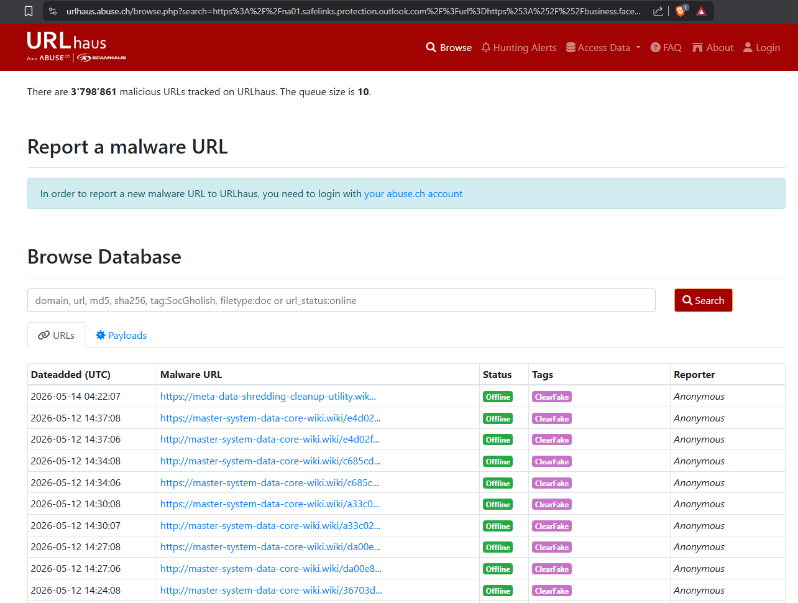

#### 4.2 Análisis de la URL del botón "View request" (SafeLinks)

**ES:** **urlscan.io**: HTTP 400 — escaneo bloqueado. Este comportamiento es normal: `na01.safelinks.protection.outlook.com` es el redirector de protección de enlaces de Microsoft. Requiere contexto de sesión de Outlook para desencapsular la URL real; los scanners externos no pueden seguir la redirección.

**EN:** **urlscan.io**: HTTP 400 — scan blocked. This is normal behavior: `na01.safelinks.protection.outlook.com` is Microsoft's link-protection redirector. It requires Outlook session context to unwrap the real URL; external scanners cannot follow the redirect.

**ES:** **VirusTotal**: 2 proveedores marcaron la URL SafeLinks como maliciosa. Señal débil: el dominio `na01.safelinks.protection.outlook.com` es compartido por todos los tenants de Outlook, y muchas URLs maliciosas que pasan por Outlook usan SafeLinks. Los flags apuntan al wrapper de Microsoft, no al destino real (`business.facebook.com`).

**EN:** **VirusTotal**: 2 vendors flagged the SafeLinks URL as malicious. Weak signal: `na01.safelinks.protection.outlook.com` is shared by all Outlook tenants, and many malicious URLs that pass through Outlook use SafeLinks. The flags point to Microsoft's wrapper, not the real destination (`business.facebook.com`).

**ES:** **WHOIS (`who.is`)**: Sin resultados para las URLs completas. Esto es esperado: WHOIS opera a nivel de **dominio registrado** (ej. `m.me`, `facebook.com`), no sobre rutas o parámetros. El WHOIS de `m.me` y `facebook.com` muestra a Meta Platforms, Inc. como propietario.

**EN:** **WHOIS (`who.is`)**: No results for the full URLs. This is expected: WHOIS operates at the level of **registered domain** (e.g., `m.me`, `facebook.com`), not paths or parameters. The WHOIS of `m.me` and `facebook.com` shows Meta Platforms, Inc. as the owner.

> **Conclusión metodológica / Methodological conclusion:**
> 
> **ES:** La ausencia de IOCs en las herramientas de threat intelligence no es un error de las herramientas — es la característica definitoria de esta variante. Toda la infraestructura es legítima de Meta. La maliciosidad reside exclusivamente en el contenido semántico del campo de nombre del negocio y en la ingeniería social fuera de banda por Messenger.
>
> **EN:** The absence of IOCs in threat intelligence tools is not a tool failure — it is the defining characteristic of this variant. All infrastructure is legitimate Meta property. The maliciousness resides exclusively in the semantic content of the business name field and in the out-of-band social engineering over Messenger.

---

### Paso 5 — Verificación de la propiedad de la infraestructura del remitente / Step 5 — Sender Infrastructure Ownership Verification

**ES:** Para afirmar que el correo proviene genuinamente de Meta y no de un suplantador, se usaron cuatro evidencias independientes y convergentes. Ninguna de ellas por sí sola es suficiente; juntas constituyen prueba irrefutable.

**EN:** To assert that the email genuinely originates from Meta and not from an impersonator, four independent and converging pieces of evidence were used. None alone is sufficient; together they constitute irrefutable proof.

#### Evidencia 1 — Reverse DNS (rDNS) de la IP de origen

**ES:** La IP de origen del correo es `69.171.232.142`. Su reverse DNS, visible en la cabecera `Received-SPF`, es:

```
helo=69-171-232-142.mail-mail.facebook.com
```

El hostname mismo declara que la IP pertenece a `mail.facebook.com`. No es una inferencia — es el nombre registrado por el propietario del bloque IP ante el sistema DNS.

**EN:** The originating IP is `69.171.232.142`. Its reverse DNS, visible in the `Received-SPF` header, is `69-171-232-142.mail-mail.facebook.com`. The hostname itself declares that the IP belongs to `mail.facebook.com`. This is not an inference — it is the name registered by the IP block's owner in the DNS system.

#### Evidencia 2 — Registro SPF del dominio `business.facebook.com`

**ES:** La cabecera `Received-SPF: Pass` en el mensaje indica que el dominio `business.facebook.com` tiene un registro SPF que **explícitamente autoriza** `69.171.232.142` como remitente legítimo. Esto puede verificarse manualmente consultando el registro TXT del dominio:

**EN:** The `Received-SPF: Pass` header indicates that `business.facebook.com` has an SPF record that **explicitly authorizes** `69.171.232.142` as a permitted sender. This can be manually verified by querying the domain's TXT record:

```bash
# Verificación manual / Manual verification
dig TXT business.facebook.com | grep "v=spf"
# O en herramientas online: mxtoolbox.com/spf.aspx
```

**ES:** Si el IP no estuviera en el SPF de Meta, el resultado sería `spf=fail` o `spf=softfail`, no `spf=pass`. Meta autorizó explícitamente ese IP para enviar en su nombre.

**EN:** If the IP were not in Meta's SPF, the result would be `spf=fail` or `spf=softfail`, not `spf=pass`. Meta explicitly authorized that IP to send on its behalf.

#### Evidencia 3 — Firma DKIM criptográfica

```
DKIM-Signature: v=1; a=rsa-sha256;
  d=business.facebook.com; s=s2048-2024-q1; t=1779721040
  dkim=pass (signature was verified) header.d=business.facebook.com
```

**ES:** Una firma DKIM válida (`dkim=pass`) con `d=business.facebook.com` prueba matemáticamente que Meta usó su clave privada para firmar el correo. Esta clave privada nunca sale de los servidores de Meta. Es imposible falsificar una firma DKIM válida para un dominio sin poseer su clave privada. Esta es la evidencia más fuerte: es criptográfica.

**EN:** A valid DKIM signature (`dkim=pass`) with `d=business.facebook.com` mathematically proves that Meta used its private key to sign the email. That private key never leaves Meta's servers. It is impossible to forge a valid DKIM signature for a domain without possessing its private key. This is the strongest evidence: it is cryptographic.

#### Evidencia 4 — ASN 32934 verificado por herramientas externas

**ES:** El ASN (Autonomous System Number) `32934` es el número de sistema autónomo de Facebook/Meta, verificable de forma independiente mediante dos herramientas:

**EN:** The ASN (Autonomous System Number) `32934` is Facebook/Meta's autonomous system number, independently verifiable using two tools:

**a) urlscan.io**:

**ES:** En el análisis de `m.me/670065706200806`, las 4 IPs contactadas pertenecen a ASN 32934, etiquetado explícitamente como `"FACEBOOK - Facebook, Inc., US"`:

**EN:** In the analysis of m.me/670065706200806, the 4 contacted IPs belong to ASN 32934, explicitly labeled as "FACEBOOK - Facebook, Inc., US":

```
157.240.0.13  → ASN 32934 (FACEBOOK - Facebook, Inc., US)
  PTR: edge-star-shv-02-fra3.facebook.com
57.144.248.128 → ASN 32934 (FACEBOOK - Facebook, Inc., US)
  PTR: xx-fbcdn-shv-01-fra3.fbcdn.net
```


**b) bgp.he.net (Hurricane Electric)**:

**ES:** Para el bloque IPv6 `2803:6086::/32` presente en la cabecera `X-Facebook`, la consulta WHOIS en `bgp.he.net/net/2803:6086::/32` reveló:

**EN:** For the IPv6 block 2803:6086::/32 present in the X-Facebook header, the WHOIS query at bgp.he.net/net/2803:6086::/32 revealed:

```
owner:      Edge Network Services Ltd
ownerid:    US-FAIN-LACNIC
person:     Facebook Network
e-mail:     noc@fb.com
address:    Hacker Way, 1
address:    94025 - Menlo Park - CA
country:    US
```

**ES:** `Edge Network Services Ltd` es la entidad legal con la que Meta registra sus bloques IP en LACNIC. El contacto `noc@fb.com` y la dirección `Hacker Way, 1, Menlo Park, CA` son inequívocamente los de Meta.

**EN:** `Edge Network Services Ltd` is the legal entity with which Meta registers its IP blocks in LACNIC. The contact `noc@fb.com` and address `Hacker Way, 1, Menlo Park, CA` are unambiguously Meta's.

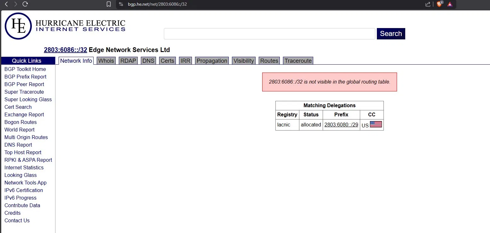

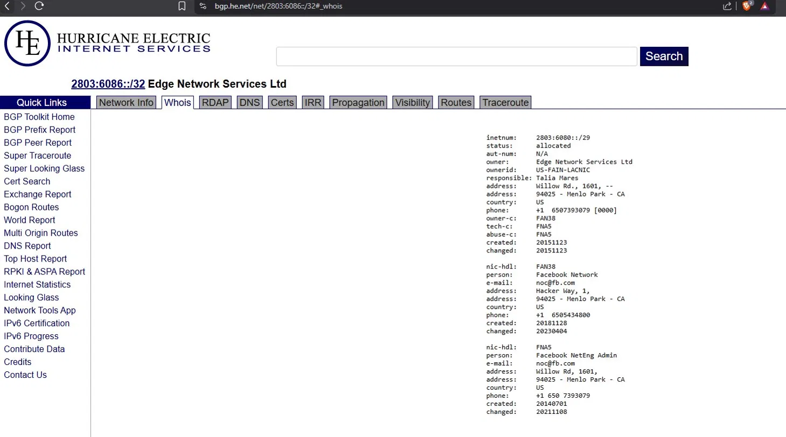

> **Conclusión / Conclusion:**
> 
> **ES:** Las cuatro evidencias —rDNS, SPF pass, DKIM criptográfico y ASN 32934 verificado externamente— confluyen en la misma conclusión: el correo fue genuinamente enviado por la infraestructura de Meta. Esto no es una vulnerabilidad de Meta en el sentido técnico; es el abuso deliberado de una funcionalidad legítima (los partner requests) para inyectar contenido malicioso en notificaciones oficiales.
>
> **EN:** The four pieces of evidence — rDNS, SPF pass, cryptographic DKIM, and externally verified ASN 32934 — all converge on the same conclusion: the email was genuinely sent by Meta's infrastructure. This is not a Meta vulnerability in the technical sense; it is the deliberate abuse of a legitimate feature (partner requests) to inject malicious content into official notifications.

---

### Paso 6 — Resolución de la página señuelo / Step 6 — Lure Page Resolution

**ES:** Para identificar la página vinculada al enlace `m.me/670065706200806` sin exponer la sesión real de Facebook, se usó una VM aislada (VirtualBox, Ubuntu, Firefox sin sesión activa). Se navegó a `https://www.facebook.com/670065706200806`, lo que redirigió a `https://www.facebook.com/people/Partner-Program-Platform/61578819584100/`.

**EN:** To identify the page linked to `m.me/670065706200806` without exposing the real Facebook session, an isolated VM was used (VirtualBox, Ubuntu, Firefox without active session). Navigating to `https://www.facebook.com/670065706200806` redirected to `https://www.facebook.com/people/Partner-Program-Platform/61578819584100/`.

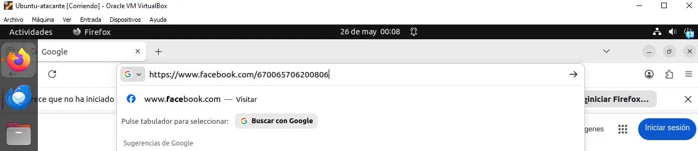

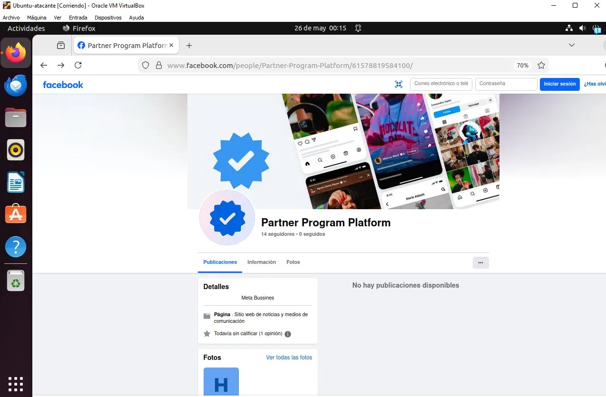

**Hallazgos en la página / Page findings:**

| Indicador / Indicator | Valor / Value | Señal / Signal |
|---|---|---|
| Nombre / Name | "Partner Program Platform" | Genérico, imita programa oficial |
| Badge azul / Blue badge | Imagen decorativa en foto de perfil | Falso — no es verificación real de Meta |
| Categoría / Category | "Sitio web de noticias y medios de comunicación" | Incongruente con ser un programa de partners |
| Seguidores / Followers | 14 | Página recién creada, sin huella legítima |
| Publicaciones / Posts | 0 | Sin actividad orgánica |
| Detalles / Details | "Meta Bussines" (sic) | Typo en el nombre de la marca |

---

## 4. Cadena de ataque detallada / Detailed Attack Chain

### Etapa 1 — Preparación e inyección del payload / Stage 1 — Preparation and Payload Injection

**ES:** El atacante crea una cuenta real de Meta Business Manager (`business_id: 2836451836418284`) y configura los campos controlables de la solicitud de socio con el texto del señuelo:

**EN:** The attacker creates a real Meta Business Manager account (`business_id: 2836451836418284`) and configures the controllable fields of the partner request with the lure text:

| Campo inyectado / Injected Field | Valor / Value |
|---|---|
| Nombre del negocio / Business name | `Your Business Is Approved for Partnership m.me/670065706200806 Other links` |
| Nombre del solicitante / Requester display name | `Meta Platforms, please see the support link above for more details.` |

### Etapa 2 — Envío por infraestructura legítima de Meta / Stage 2 — Delivery via Legitimate Meta Infrastructure

**ES:** Meta genera y entrega la notificación desde `noreply@business.facebook.com`. Los campos inyectados son renderizados verbatim dentro de la plantilla oficial. SPF, DKIM, DMARC y compauth = pass. El correo pasa todos los controles de email gateway.

**EN:** Meta generates and delivers the notification from `noreply@business.facebook.com`. Injected fields are rendered verbatim inside the official template. SPF, DKIM, DMARC, and compauth = pass. The email passes all email gateway controls.

### Etapa 3 — Entrega con cero IOCs / Stage 3 — Delivery with Zero IOCs

**ES:** El botón "View request" apunta a `business.facebook.com` real. No hay dominios lookalike, adjuntos ni formularios de robo de credenciales. Los controles de autenticación no pueden detectar maliciosidad porque el correo es auténtico.

**EN:** The "View request" button points to the real `business.facebook.com`. No lookalike domains, attachments, or credential-harvesting forms are present. Authentication controls cannot detect maliciousness because the email is authentic.

### Etapa 4 — Señuelo en Messenger / Stage 4 — Messenger Lure

**ES:** La víctima abre `m.me/670065706200806`, que redirige a la página señuelo "Partner Program Platform". El atacante conduce ingeniería social fuera de banda en Messenger para obtener credenciales, códigos 2FA, o aprobación directa del partner request.

**EN:** The victim opens `m.me/670065706200806`, redirecting to the "Partner Program Platform" lure page. The attacker conducts out-of-band social engineering over Messenger to obtain credentials, 2FA codes, or direct partner request approval.

### Etapa 5 — Impacto / Stage 5 — Impact

**ES:** Con acceso de socio o credenciales comprometidas, el atacante controla cuentas publicitarias (drenaje de presupuesto), Pages (secuestro de marca), píxeles (exfiltración de audiencias) y métodos de pago. En agencias, el radio de explosión abarca toda la cartera de clientes.

**EN:** With partner access or compromised credentials, the attacker controls ad accounts (budget drainage), Pages (brand hijacking), pixels (audience exfiltration), and payment methods. In agencies, the blast radius spans the entire client portfolio.

---

## 5. Indicadores de compromiso / Indicators of Compromise (IOCs)

> Todos los IOCs están defanged / All IOCs are defanged.

| Tipo / Type | Valor (defanged) | Descripción / Description |
|---|---|---|
| Messenger lure | `hxxp://m[.]me/670065706200806` | Enlace señuelo en el cuerpo |
| FB Page/Thread ID | `670065706200806` | ID del enlace m.me |
| FB Profile ID | `61578819584100` | Página "Partner Program Platform" |
| Business Manager ID | `2836451836418284` | Cuenta BM del atacante |
| Partner Request ID | `980425691238214` | Solicitud de socio creada |
| Sender IP (Meta — no bloquear) | `69.171.232.142` | ASN 32934, mail-mail.facebook.com |
| DKIM domain | `business[.]facebook[.]com` | Firmante legítimo |
| Message-ID | `d5c4c4f1-6248-45a8-be7d-93ba0279c187@business.facebook.com` | ID de la muestra |
| Requester display name | `Meta Platforms, please see the support link above for more details.` | Nombre falso del solicitante |
| Business display name | `Your Business Is Approved for Partnership m.me/670065706200806 Other links` | Nombre inyectado del BM |

> **Nota:**
> 
> **ES:**  `69.171.232.142` y `business.facebook.com` son infraestructura legítima de Meta. No deben bloquearse; hacerlo afectaría notificaciones reales de Business Manager.
>
> **EN:** `69.171.232.142` and `business.facebook.com` are legitimate Meta infrastructure. They should not be blocked; doing so would affect real Business Manager notifications.

---

## 6. Mapeo a MITRE ATT&CK / MITRE ATT&CK Mapping

| Táctica / Tactic | ID | Técnica / Technique | Aplicación / Application |
|---|---|---|---|
| Resource Development | [T1585.003](https://attack.mitre.org/techniques/T1585/003/) | Establish Accounts: Cloud Accounts | Real Meta Business account + lure page created as attack infra |
| Resource Development | [T1583.006](https://attack.mitre.org/techniques/T1583/006/) | Acquire Infrastructure: Web Services | Meta BM partner-request system used as delivery mechanism |
| Initial Access | [T1566.003](https://attack.mitre.org/techniques/T1566/003/) | Phishing: Spearphishing via Service | Legitimate Meta notification used to deliver lure |
| Initial Access | [T1199](https://attack.mitre.org/techniques/T1199/) | Trusted Relationship | Legitimate partner invitation workflow abused |
| Defense Evasion | [T1036.005](https://attack.mitre.org/techniques/T1036/005/) | Masquerade: Match Legitimate Name or Location | Requester name set to "Meta Platforms…" |
| Defense Evasion | [T1656](https://attack.mitre.org/techniques/T1656/) | Impersonation | Lure page with fake blue verification badge |
| Credential Access | [T1111](https://attack.mitre.org/techniques/T1111/) | MFA Interception | Messenger conversation used to socially engineer 2FA codes |
| Impact | [T1657](https://attack.mitre.org/techniques/T1657/) | Financial Theft | Unauthorized ad spend on compromised accounts |
| Impact | [T1531](https://attack.mitre.org/techniques/T1531/) | Account Access Removal | Legitimate admins locked out after partner access granted |

---

## 7. Evidencia de campaña activa / Evidence of Active Campaign

### 7.1 Análisis técnico independiente

> **Prophet Security (Mayo 2026 / May 2026):**
> 
> **ES:** Documenta campañas que usan la infraestructura de partner-invitation de Meta BM donde notificaciones genuinas incluyen links a páginas de robo de credenciales. Confirma SPF/DKIM/DMARC pass como mecanismo de bypass. Detectado en múltiples clientes enterprise.
>
> **EN:** Documents campaigns using Meta BM's partner-invitation infrastructure where genuine notifications include links to credential theft pages. Confirms SPF/DKIM/DMARC pass as bypass mechanism. Detected in multiple enterprise clients.
>
> **alphaMountain.ai (Abril 2026 / April 2026):**
> 
> **ES:** Identifica campaña con dominios recién registrados (`marketing-partner-join[.]com`, 20 subdominios rotativos). Estima ~2,350 correos de phishing por día en volumen detectado.
>
> **EN:** Identifies a campaign with newly registered domains (`marketing-partner-join[.]com`, 20 rotating subdomains). Estimates ~2,350 phishing emails per day in detected volume.
>
> **Check Point Research (Noviembre 2025 / November 2025):**
> 
> **ES:** Reporta >40,000 correos enviados a ~5,000 empresas en EE.UU., Europa, Canadá y Australia desde el dominio legítimo `facebookmail.com` mediante la función de invitación de Business Manager.
>
> **EN:** Reports >40,000 emails sent to ~5,000 companies in the US, Europe, Canada, and Australia from the legitimate domain `facebookmail.com` via the Business Manager invitation feature.
> 

### 7.2 Diferenciador de esta variante

**ES:** La variante aquí documentada no utiliza ningún dominio malicioso. Esto la hace **indetectable por feeds de threat intelligence de URLs** y **más avanzada técnicamente** que las variantes publicadas.
**EN:** The variant documented here does not use any malicious domains. This makes it **undetectable by URL threat intelligence feeds** and **technically more advanced** than the published variants.

### 7.3 Reportes de víctimas en Reddit

**ES:** Durante la investigación se identificaron múltiples publicaciones recientes en subreddits de Facebook Ads y ciberseguridad donde usuarios reportan haber recibido el mismo tipo de correo, varios asociados a la página "Partner Program Platform" (profile_id `61578819584100`). La recurrencia del mismo page ID en reportes independientes confirma una campaña organizada en curso.
**EN:** During the investigation, multiple recent posts were identified on Facebook Ads and cybersecurity subreddits where users report having received the same type of email, several associated with the page "Partner Program Platform" (profile_id `61578819584100`). The recurrence of the same page ID in independent reports confirms an ongoing organized campaign.

> **ES:** Query para reproducir: `site:reddit.com "Partner Program Platform" facebook business manager partner request`
> **EN:** Query to reproduce: `site:reddit.com "Partner Program Platform" facebook business manager partner request`

---

## 8. Recomendaciones de mitigación y defensa / Mitigation & Defense

### 8.1 Usuarios individuales / Individual Users

> **ES:**
> 1. Nunca aprobar un partner request no iniciado por ti. Verifica directamente en `business.facebook.com` escribiendo la URL manualmente.
> 2. Meta nunca solicita credenciales, 2FA ni pagos por correo ni Messenger.
> 3. Si el cuerpo de la notificación contiene `m.me/` donde debería aparecer un nombre de socio legítimo, es una señal de alerta inmediata.
> 4. Habilitar 2FA en Facebook y Meta Business.
> 
> **EN:**
> 1. Never approve a partner request you did not initiate. Verify directly at `business.facebook.com` by typing the URL manually.
> 2. Meta never requests credentials, 2FA codes, or payments via email or Messenger.
> 3. If the notification body contains `m.me/` where a legitimate partner name should appear, that is an immediate red flag.
> 4. Enable 2FA on Facebook and Meta Business.

### 8.2 Empresas y agencias / Companies and Agencies

> **ES:**
> 1. Proceso formal de verificación out-of-band antes de aprobar cualquier partner request.
> 2. Auditoría periódica de `business.facebook.com → Settings → Partners`.
> 3. Principio de mínimo privilegio en Business Manager.
> 4. Capacitación del equipo de marketing en esta variante específica, con énfasis en que autenticación perfecta no implica contenido legítimo.
> 
> **EN:**
> 1. Formal out-of-band verification process before approving any partner request.
> 2. Periodic audit of `business.facebook.com → Settings → Partners`.
> 3. Principle of least privilege in Business Manager.
> 4. Train marketing teams on this specific variant, emphasizing that perfect authentication does not imply legitimate content.

### 8.3 Equipos de seguridad / Security Team (Blue Team)

> **ES:**
> 1. **SPF/DKIM/DMARC son insuficientes para detectar esta variante.** La detección requiere análisis semántico del cuerpo.
> 2. Reglas SIEM/DLP: alertar ante correos de `noreply@business.facebook.com` cuyo campo "This request is from:" o nombre del negocio contenga una URL (`m.me/`, `http://`, `www.`).
> 3. Monitorear creación de partners en Business Manager mediante audit logs de Meta Business Suite.
> 4. Reportar a Meta: `phish@fb.com`, incluyendo el `business_id` del atacante.
> 5. Indicadores de esta variante: ausencia de dominios lookalike + todos los links a Meta/Microsoft + `m.me/` en campo de nombre + página señuelo reciente con badge falso.
> 
> **EN:**
> 1. **SPF/DKIM/DMARC are insufficient to detect this variant.** Detection requires semantic body analysis.
> 2. SIEM/DLP rules: alert on emails from `noreply@business.facebook.com` whose "This request is from:" or business name field contains a URL (`m.me/`, `http://`, `www.`).
> 3. Monitor partner creation in Business Manager via Meta Business Suite audit logs.
> 4. Report to Meta: `phish@fb.com`, including the attacker's `business_id`.
> 5. Indicators of this variant: no lookalike domains + all links to Meta/Microsoft + `m.me/` in name field + recent lure page with fake badge.

---

## Apéndice A / Appendix A

### Cabeceras redactadas / Redacted Email Headers

**ES:** Archivo completo disponible en `evidence/meta_partner_request_REDACTED.eml`. Datos de identificación del destinatario e infra interna de Outlook redactados.

**EN:** Full file available at `evidence/meta_partner_request_REDACTED.eml`. Recipient identification and internal Outlook routing redacted.

```
Received: from [REDACTED_OUTLOOK_INTERNAL] by [REDACTED_OUTLOOK_INTERNAL]
  with HTTPS; Mon, 25 May 2026 14:57:23 +0000
Received: from [REDACTED_OUTLOOK_INTERNAL] by [REDACTED_OUTLOOK_INTERNAL]
  (TLS1_3) via Frontend Transport; Mon, 25 May 2026 14:57:21 +0000
Received: from 69-171-232-142.mail-mail.facebook.com (69.171.232.142)
  by [REDACTED_OUTLOOK_INTERNAL]; Mon, 25 May 2026 14:57:20 +0000

Authentication-Results:
  spf=pass    (sender IP is 69.171.232.142)
              smtp.mailfrom=business.facebook.com
  dkim=pass   (signature was verified)
              header.d=business.facebook.com
  dmarc=pass  action=none
              header.from=business.facebook.com
  compauth=pass reason=100

Received-SPF: Pass
  domain of business.facebook.com designates 69.171.232.142 as permitted sender
  client-ip=69.171.232.142
  helo=69-171-232-142.mail-mail.facebook.com

DKIM-Signature: v=1; a=rsa-sha256; c=relaxed/simple;
  d=business.facebook.com; s=s2048-2024-q1;
  t=1779721040 (= 2026-05-25 14:57:20 UTC)

X-Facebook: from 2803:6086:3013:222:21ea:8601:15c8:a00
  by business.facebook.com with HTTPS (ZuckMail)
  [IPv6 WHOIS → Edge Network Services Ltd, noc@fb.com, Hacker Way 1 — Meta]

Date: Mon, 25 May 2026 07:41:56 -0700
To: [REDACTED_RECIPIENT]
Subject: You've received a Business Manager partner request
X-Mailer: ZuckMail [version 1.00]
Return-Path: noreply@business.facebook.com
From: "Facebook" <noreply@business.facebook.com>
Reply-To: noreply <noreply@facebookmail.com>
X-Facebook-Notify: business_manager_partner_request_unreg; mailid=[REDACTED]
X-FB-Internal-Notiftype: business_manager_partner_request_unreg
BIMI-Selector: v=BIMI1; s=default;
Message-ID: <d5c4c4f1-6248-45a8-be7d-93ba0279c187@business.facebook.com>
MIME-Version: 1.0
```

### Nota sobre el campo mailid / Note on mailid field

**ES:** El campo `mailid` decodifica base64 a `<notification_id>:[REDACTED_RECIPIENT]:<sequence>`, confirmando que la notificación fue dirigida específicamente a la dirección destinataria, no es envío masivo indiferenciado.

**EN:** The `mailid` field base64-decodes to `<notification_id>:[REDACTED_RECIPIENT]:<sequence>`, confirming the notification was specifically targeted at the recipient address, not undifferentiated bulk sending.

---

## Estructura del repositorio / Repository Structure

```
meta-business-partner-phishing-2026/
├── README.md                                    ← Este informe / This report
├── assets/
│   └── attack_chain_diagram.svg                 ← Diagrama de la cadena de ataque
├── evidence/
│   ├── meta_partner_request_REDACTED.eml        ← Muestra de correo (PII redactada)
│   └── evidence_hashes.txt                      ← SHA-256 / MD5 de la muestra
└── screenshots/
    ├── 00_email_content.png                     ← Contenido del mensaje
    ├── 01_view_source_outlook.png               ← Menú "Ver origen del mensaje"
    ├── 02_auth_headers.png                      ← Cabeceras de autenticación
    ├── 03_devtools_mme.png                      ← DevTools: enlace m.me en DOM
    ├── 04_devtools_viewrequest.png              ← DevTools: originalsrc del botón
    ├── 05_urlscan_mme_result.png                ← urlscan.io resultado completo
    ├── 06_urlscan_mme_asn.png                   ← urlscan.io tabla de IPs / ASN
    ├── 07_virustotal_mme.png                    ← VirusTotal resultado m.me
    ├── 08_urlhaus_noise.png                     ← URLhaus (falso positivo ClearFake)
    ├── 09_bgp_he_net_info.png                   ← bgp.he.net IPv6 Network Info
    ├── 10_bgp_he_net_whois.png                  ← bgp.he.net WHOIS (Facebook Network)
    ├── 11_vm_navigation.png                     ← VM navegando a facebook.com/670...
    └── 12_facebook_page_lure.png                ← Página "Partner Program Platform"
```

---

## Referencias / References

1. Prophet Security — *Facebook Phishing Email Campaign: How Attackers Are Weaponizing Meta Business Manager Partner Requests* (May 2026). https://www.prophetsecurity.ai/blog/facebook-phishing-email-how-attackers-weaponize-meta-business-manager
2. alphaMountain.ai — *Meta Business Manager Phishing Campaign Is Hitting Enterprise Inboxes* (April 2026). https://www.alphamountain.ai/meta-business-manager-phishing/
3. The Register / Check Point Research — *Phishers try to lure 5K Facebook advertisers with fake business pages* (November 2025). https://www.theregister.com/2025/11/10/5k_facebook_advertising_customers_phishing/
4. TechRadar / Check Point — *Fake Facebook Business pages are bombarding users with phishing messages* (2026). https://www.techradar.com/pro/security/fake-facebook-business-pages-are-bombarding-users-with-phishing-messages-so-what-can-be-done
5. Biondo Creative — *Meta Business Manager Phishing Scam: How to Spot It and Protect Your Account* (May 2026). https://www.biondocreative.com/2026/05/meta-business-manager-phishing-scam-how-to-spot-it-and-protect-your-account/
6. MITRE ATT&CK Enterprise — https://attack.mitre.org/techniques/enterprise/
7. urlscan.io — Scan result for `http://m.me/670065706200806`: https://urlscan.io/result/019e627a-e78c-774e-824e-1c069791133b/
8. Hurricane Electric BGP Toolkit — WHOIS for `2803:6086::/32`: https://bgp.he.net/net/2803:6086::/32#_whois
9. Reddit community reports (r/FacebookAds, cybersecurity subreddits) — Multiple independent victim reports referencing page ID `61578819584100`. Query: `site:reddit.com "Partner Program Platform" facebook business manager phishing`

---

*Reportar muestras adicionales a Meta: `phish@fb.com` (incluir el business_id del atacante para facilitar el takedown).*  
*Report additional samples to Meta: `phish@fb.com` (include the attacker's business_id to facilitate takedown).*

*Este informe fue preparado por el analista que recibió la muestra y condujo el análisis forense completo: origen del mensaje, DevTools, análisis pasivo de URLs, verificación de infraestructura y atribución de campaña.*  
*This report was prepared by the analyst who received the sample and conducted the full forensic analysis: message source, DevTools, passive URL analysis, infrastructure verification, and campaign attribution.*
